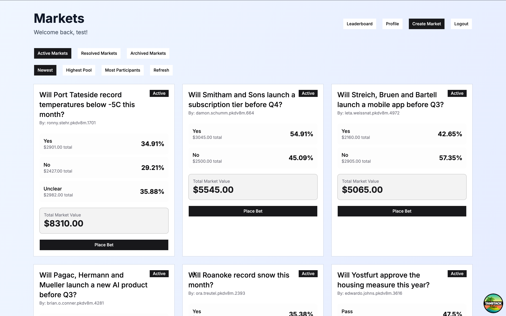
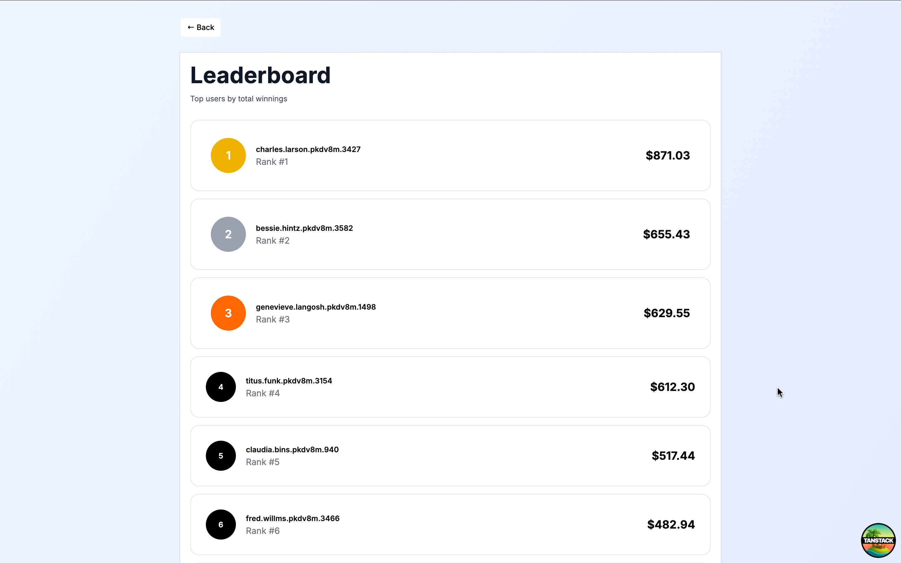
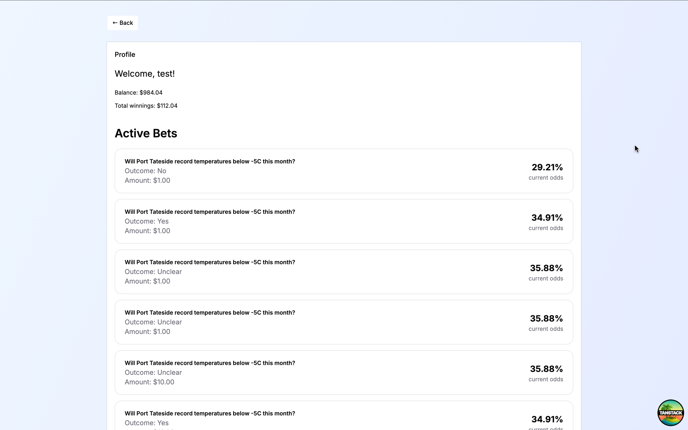
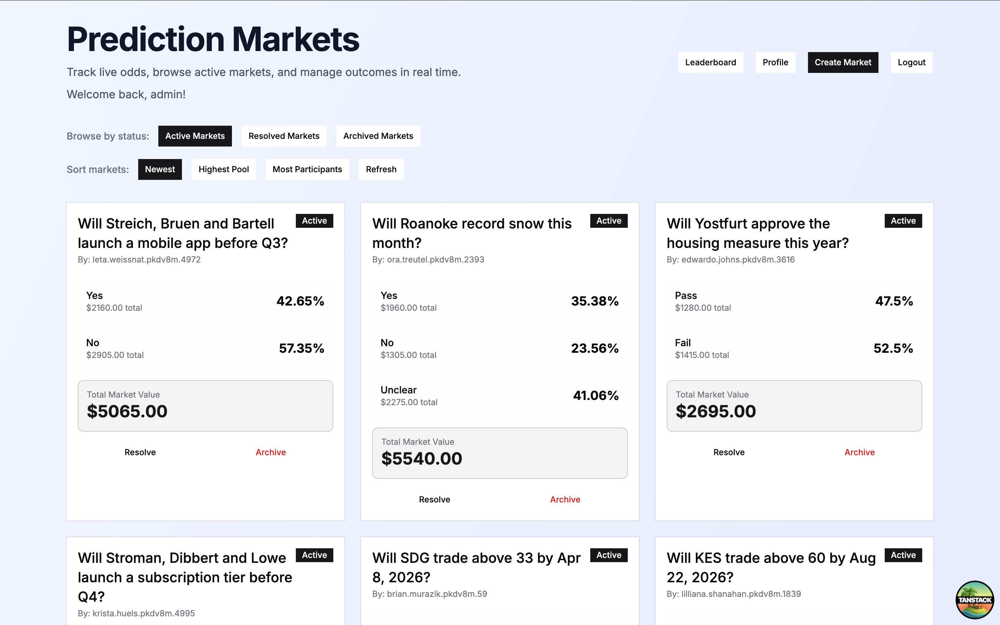

# Submission

## Short Description

This project is a full-stack prediction markets application where users can create markets, place bets on different outcomes, and track results in real time.

It supports both user and admin roles, real-time updates via polling, market resolution with proportional payout distribution, and full lifecycle management (active, resolved, archived markets).

The application focuses on clean UI/UX, real-time data handling, and end-to-end functionality from database to frontend.

---

## Video Demo

### User Flow

Covers browsing markets, placing bets, and tracking activity in the profile.

https://drive.google.com/file/d/1XbIL5XZJ3juE5ramPAN-79K19UdrCJHk/view?usp=sharing

### Admin Flow

Covers resolving and archiving markets, including payout distribution.

https://drive.google.com/file/d/1GcQQJ158CI9ZsuEDbiFJ7QL-g3L0NaR-/view?usp=sharing

---

## Images

Below are key screens from the application, covering both user and admin flows.

### Dashboard

### Leaderboard

### Profile

### Admin Controls

